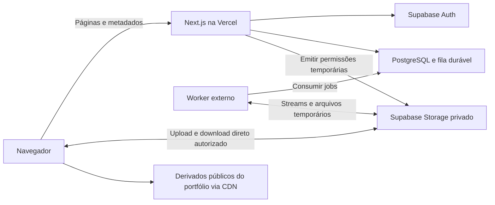

# Arquitetura técnica

Status: arquitetura de referência; Fase 1 implementada e infraestrutura da Fase 2 preparada, com validação em banco pendente. Fase 3 e posteriores permanecem planejadas. Detalhes e limites em [DATA_ACCESS.md](DATA_ACCESS.md).
Data: 23/09/2026. Base: [PROJECT_SPEC.md](PROJECT_SPEC.md) e decisões do usuário.
Sequência de entrega: [IMPLEMENTATION_PLAN.md](IMPLEMENTATION_PLAN.md).

## 1. Visão geral e decisões

Adotar um monólito modular em Next.js com App Router, React, TypeScript estrito e Tailwind CSS, hospedado na Vercel. Supabase fornece PostgreSQL, autenticação administrativa e o Storage inicial. Apenas a fotógrafa possui conta. Clientes acessam galerias por uma credencial de compartilhamento, sem cadastro e sem usuário anônimo no Supabase Auth.

O Next.js coordena operações, valida permissões e movimenta metadados pequenos. Fotografias e arquivos ZIP trafegam diretamente entre navegador e Object Storage. Um worker separado executa geração de variantes, ZIPs e limpeza: não usar Server Actions, Route Handlers ou tarefas em segundo plano de uma requisição Vercel para processar arquivos grandes.



O worker será um processo Node.js/TypeScript em container com CPU, memória e disco temporário limitados, hospedado fora das Functions da Vercel. O fornecedor desse runtime permanece uma decisão operacional antes da fase de processamento; não altera os contratos da aplicação. Usar inicialmente uma fila de jobs no PostgreSQL, sem exigir Redis ou outro serviço de mensageria.

Não incluir nesta versão pagamentos, contas de clientes, favoritos persistentes, aprovação de fotos, venda de fotos ou integrações com CRM. Seleção temporária para download faz parte da primeira versão.

## 2. Frontend

- Server Components para páginas, consultas e composição; Client Components apenas para formulários, upload, seleção, lightbox e interações.
- Grupos de rotas para site público, administração e entrega privada, com layouts próprios. Grupos não são controles de autorização.
- Componentes visuais reutilizáveis, mobile-first, fotografias em destaque, tipografia consistente e animações discretas com respeito a movimento reduzido.
- Estados de carregamento, vazio, erro, processamento e retry. Lightbox com teclado, fechamento por Escape, gerenciamento e retorno de foco; formulários com labels e mensagens acessíveis.
- Paginação por cursor nas galerias grandes, lazy loading e dimensões reservadas para evitar deslocamento de layout. Seleção por IDs estáveis, sem manter originais em memória.
- Imagens públicas podem usar `next/image` e CDN. Imagens privadas usam variantes prontas e URLs assinadas diretamente, com `img` responsivo ou `next/image` sem otimização; não passar imagens privadas pelo cache compartilhado do otimizador Next.js.
- Componentes nunca recebem hashes de senha, tokens persistidos, credenciais de serviço ou modelos completos de banco quando um DTO reduzido é suficiente.

## 3. Backend e limites dos módulos

Fluxo: página/Route Handler/Server Action → caso de uso → regras de domínio → interfaces de repository/Storage → adaptador. O domínio não importa SDKs do Supabase nem objetos HTTP do Next.js.

Server Actions atendem mutações pequenas dos formulários. Route Handlers atendem emissão de upload/download, troca do token por sessão e consulta de jobs. Ambos executam a mesma autorização nos casos de uso. Server Components chamam serviços diretamente, sem requisições HTTP para a própria aplicação.

Usar runtime Node.js nas operações que exigem criptografia e bibliotecas nativas. Módulos com credenciais são `server-only`. Queries e mutações administrativas usam preferencialmente o cliente Supabase vinculado à sessão e RLS. Acesso privilegiado fica isolado nos casos de uso de convidados e tarefas internas, após autorização explícita.

Jobs possuem estados `queued`, `running`, `succeeded`, `failed`, `cancelled`, tentativas, próxima execução, lease e heartbeat. Uma operação transacional registra a mudança de estado e o job; claim atômico impede consumo simultâneo. Processamento é pelo menos uma vez: chaves de idempotência, artefatos versionados, retries com backoff e recuperação de leases vencidos são obrigatórios. Não manter transação aberta durante processamento de mídia.

## 4. Banco de dados

PostgreSQL no Supabase, migrations SQL versionadas e tipos TypeScript gerados. Começar com repositories sobre a API Supabase; não adicionar ORM sem necessidade concreta. Operações atômicas de múltiplas tabelas usam funções SQL/RPC restritas. Funções privilegiadas devem fixar `search_path`, validar permissões e limitar `EXECUTE`.

UUIDs identificam entidades; `timestamptz` representa instantes em UTC; datas de ensaio sem horário usam `date`; tamanhos usam `bigint`. O frontend converte a exibição para o fuso configurado. Nunca guardar bytes de fotos no banco, URLs assinadas ou URLs absolutas como referência canônica do objeto.

### Principais tabelas

| Tabela | Campos principais e finalidade |
| --- | --- |
| `admin_users` | `user_id` PK/FK para `auth.users`, `active`, timestamps; uma única administradora ativa inicialmente, provisionada por operação controlada |
| `clients` | `id`, `name`, contatos opcionais e timestamps; cadastro comercial sem vínculo obrigatório com Auth |
| `galleries` | `id`, `client_id`, título, descrição, data, `cover_photo_id`, `status` (`draft`, `published`, `archived`), `expires_at`, `downloads_enabled`, `access_version`, `content_version`, `created_by` |
| `gallery_access_links` | `id`, `gallery_id`, `token_hash` único, `token_ciphertext`, `key_version`, `password_hash` opcional, `revoked_at`, timestamps; um link ativo por galeria inicialmente |
| `gallery_sessions` | `id`, `gallery_id`, `access_link_id`, `session_hash` único, `access_version`, `expires_at`, `revoked_at`; sessão de visitante, não usuário Auth |
| `photos` | `id`, `gallery_id` ou `portfolio_project_id`, nome original, legenda/alt, posição, status de processamento, timestamps |
| `photo_assets` | `id`, `photo_id`, variante (`original`, `preview`, `thumbnail`), versão, formato, largura, altura, bytes, checksum, `storage_provider`, bucket, `object_key`, `visibility`, status |
| `upload_sessions` | `id`, `photo_id`, chave reservada, provedor/bucket, MIME e bytes esperados, estado, expiração, chave de idempotência; sem credencial de upload persistida em texto |
| `jobs` | tipo, payload com IDs, estado, lease, tentativas, erro sanitizado, progresso e chave de idempotência |
| `download_requests` | `id`, `gallery_id`, sessão solicitante opcional, tipo individual/lote, estado, versão de acesso/conteúdo, `expires_at`, `job_id` opcional |
| `download_request_items` | `download_request_id`, `photo_id`, `original_asset_id`; seleção normalizada e snapshot das versões |
| `download_artifacts` | `id`, `download_request_id`, parte, provedor/bucket/chave, bytes, checksum, `expires_at`, estado; suporta ZIP dividido por limites |
| `download_events` | galeria, foto ou solicitação, evento (`requested`, `url_issued`, `failed`), data e contexto mínimo; sem prometer prova de transferência concluída |
| `portfolio_categories` | `id`, nome, slug único, posição, estado; categorias administráveis em evolução posterior |
| `portfolio_projects` | `id`, categoria, título, slug único, descrição, data, capa, estado de publicação, timestamps |
| `services` | `id`, título, slug, descrição, referência de imagem pública, posição e estado |
| `site_settings` | registro único com marca, biografia, redes sociais e referências de mídia pública |
| `testimonials` | nome autorizado, texto, posição e estado de publicação |
| `contact_requests` | nome, WhatsApp, e-mail, tipo de ensaio, data, local, mensagem, estado e timestamps |
| `audit_events` | ação administrativa, ator, entidade, data e contexto mínimo sanitizado |

`services` e `site_settings` referenciam um `photo_asset` público de projeto editorial; imagens editoriais podem pertencer a projetos não listados no portfólio. Referências públicas só são expostas após publicação explícita do asset.

### Relacionamentos e invariantes

- Cliente 1:N galerias; galeria 1:N fotos, links, sessões e solicitações de download.
- Categoria 1:N projetos; projeto 1:N fotos; foto 1:N assets. `CHECK` exige exatamente um proprietário da foto: galeria ou projeto.
- Solicitação 1:N itens e artefatos. Itens só podem apontar para originais da galeria autorizada; validar na transação e com constraints/triggers quando necessário.
- A capa deve pertencer ao mesmo projeto/galeria; proteger essa invariável no banco, não apenas na interface.
- Unicidade por foto/variante/versão/formato/dimensão e por provedor/bucket/chave; chaves de objetos são imutáveis.
- Índices nas FKs, slugs, hashes, ordenação de fotos, expirações e jobs pendentes. Contagens e bytes vêm de agregações sobre arquivos confirmados; otimizar com resumos reconciliáveis somente se necessário.
- Alterar fotos incrementa `content_version`; alterações de acesso incrementam `access_version`. Downloads pendentes são invalidados quando suas versões deixam de ser válidas.
- Exclusão primeiro bloqueia acesso e marca pendência. Job remove objetos, variantes e ZIPs; apenas depois elimina metadados. Banco e Storage não têm transação conjunta: retries e reconciliação tratam órfãos e falhas parciais.

## 5. Autenticação e proteção administrativa

Supabase Auth com e-mail/senha para a fotógrafa, recuperação de senha e logout. Desabilitar cadastro público; provisionar uma conta e vinculá-la a `admin_users` por procedimento restrito. Clientes nunca usam esse fluxo. Recomenda-se MFA para produção, validando o nível da sessão se habilitado.

Integrar sessões SSR com `@supabase/ssr`. Verificar token no servidor por método validado pelo SDK e consultar `admin_users.active`; não confiar no objeto retornado apenas de cookies/local storage. O Proxy do Next.js renova sessão e faz redirecionamentos preliminares, mas não substitui autorização. A nomenclatura `proxy.ts` depende da versão fixada na fundação. Referências: [Supabase SSR](https://supabase.com/docs/guides/auth/server-side/creating-a-client?queryGroups=framework&framework=nextjs) e [autenticação no Next.js](https://nextjs.org/docs/app/guides/authentication).

Proteger `/admin`, suas páginas, dados, Server Actions e APIs, inclusive chamadas diretas sem passar pelo layout. Login e recuperação ficam acessíveis sem sessão. Configurar redirects de autenticação por allowlist, impedindo redirecionamento aberto. Desativar uma administradora deve impedir novas operações mesmo com JWT ainda válido.

## 6. Autorização e RLS

| Ator | Permissões |
| --- | --- |
| Visitante público | Conteúdo editorial publicado; envio validado de contato pelo backend |
| Cliente com sessão de galeria | Metadados, thumbnails e previews da própria galeria; originais/ZIP somente com download habilitado |
| Administradora ativa | Gerenciar conteúdo, clientes e galerias; emitir uploads e downloads autorizados |
| Worker | Consumir jobs e operar os objetos necessários; sem endpoint público de execução arbitrária |

Habilitar RLS e grants mínimos nas tabelas expostas. Políticas administrativas verificam `auth.uid()` contra `admin_users`; a aplicação não pode promover usuários por campos editáveis. Visitantes não consultam diretamente tabelas privadas. Conteúdo público usa projeções que expõem somente campos publicados; tabelas de contato não permitem leitura anônima.

O backend de convidados valida a sessão e resolve a galeria antes de utilizar um repository privilegiado. Nunca aceitar `gallery_id`, `photo_id`, bucket ou chave como prova de permissão. Credenciais privilegiadas podem ignorar RLS: cada operação com elas precisa de autorização própria e testes de acesso cruzado. Ver [RLS do Supabase](https://supabase.com/docs/guides/database/postgres/row-level-security).

Buckets privados sem listagem/leitura anônima. Políticas de Storage não dão acesso genérico a qualquer usuário autenticado; credenciais temporárias emitidas pelo backend são limitadas ao objeto reservado. RLS do banco não substitui as políticas de Storage.

## 7. Galerias privadas, tokens e senhas

Toda galeria compartilhada exige token; senha é uma camada adicional, nunca uma alternativa ao token. Link no formato `/galeria/<token>` com pelo menos 32 bytes aleatórios criptograficamente seguros em base64url. Persistir SHA-256 do token para lookup indexado; não usar IDs sequenciais, UUID da galeria ou JWT administrativo como segredo de compartilhamento.

Para permitir copiar novamente o mesmo link no painel, guardar também o token cifrado com AEAD (por exemplo AES-256-GCM), nonce único e versão de chave. A chave fica apenas no ambiente do servidor; hash e ciphertext nunca saem nos DTOs de clientes. Só a administradora pode recuperar o link. Esse custo é deliberado para cumprir a função de copiar link; rotação substitui hash/ciphertext e invalida o anterior.

Senha opcional armazenada com Argon2id, salt exclusivo e parâmetros medidos no runtime Node.js; nunca cifrar reversivelmente ou usar SHA-256 para senhas. Aplicar limites de tamanho antes do hash e comparação pela biblioteca adequada. Senha deve ser enviada por POST, nunca em URL.

### Fluxo de entrada

1. Receber o token por HTTPS e consultar seu hash; checar publicação, revogação e expiração antes de devolver dados privados.
2. Se necessário, apresentar formulário genérico e validar senha com rate limiting persistente por origem e link, sem revelar nome, capa ou cliente antes da autorização.
3. Gerar sessão opaca aleatória, armazenar apenas seu hash com galeria, link, versão de acesso e vencimento. Enviar cookie `HttpOnly`, `Secure` em produção, `SameSite=Lax` e escopo de caminho adequado.
4. Redirecionar para uma rota sem token, como `/entrega/<gallery-id>`. O ID não autoriza acesso; o cookie é validado a cada consulta. Permitir sessões de galerias diferentes sem sobrescrever indevidamente cookies.
5. Em cada emissão de URL, verificar novamente sessão, vínculo do arquivo, galeria, versões e política de download. Páginas privadas e respostas de autorização usam `Cache-Control: private, no-store`.

Usar `Referrer-Policy: no-referrer`, excluir essas rotas de analytics/scripts de terceiros e mascarar caminhos com token em observabilidade. O token ainda pode aparecer no histórico, mensagens e logs da infraestrutura: revisar a configuração do host e tratar o link como credencial compartilhável. Qualquer pessoa com link e senha, quando exigida, tem o mesmo acesso; não há identidade comprovada do cliente.

## 8. Expiração e revogação

`galleries.expires_at = null` significa sem expiração programada. O horário do servidor é a autoridade; a interface informa o fuso. Sessões têm prazo próprio curto, limitado ao prazo da galeria. Nova sessão requer novamente o link e, quando aplicável, a senha.

Arquivar, excluir, trocar senha, rotacionar link ou alterar permissões incrementa `access_version` e invalida sessões/jobs incompatíveis. Galeria vencida é negada no momento da requisição, sem depender de cron. Rotina de limpeza remove sessões/artefatos vencidos, mas expiração de acesso não apaga automaticamente originais; retenção deve ser configurada separadamente.

URLs assinadas são credenciais temporárias independentes: uma URL já emitida pode funcionar até seu vencimento mesmo após revogação na aplicação. Usar prazo curto (proposta inicial: até 5 minutos) e limitar a emissão ao menor prazo restante da sessão, galeria e artefato. Arredondar para baixo e negar emissão sem tempo suficiente. Não prometer interrupção de download iniciado nem remoção de uma cópia já baixada. Testar comportamento real de cache e expiração do provedor.

## 9. Object Storage e variantes

Separar buckets lógicos: `originals-private`, `derivatives-private`, `archives-private`, `portfolio-public`. Nomes físicos são configuráveis por ambiente. Originais permanecem privados, inclusive de projetos públicos. Apenas derivados explicitamente publicados do portfólio são públicos; publicar foto de cliente exige uma operação editorial explícita, não tornar pública a galeria.

Chaves geradas no servidor, sem nome de cliente ou token: `galleries/<id>/photos/<id>/<version>/original.ext` e equivalentes para variantes. Aleatoriedade de chave é defesa complementar; privacidade depende das permissões. MIME, tamanho e hash pertencem aos metadados.

| Variante | Uso | Política inicial proposta |
| --- | --- | --- |
| Original | Preservação e download | Bytes intactos, checksum, acesso privado, sem uso na navegação |
| Preview | Lightbox | Derivados com maior lado de até 1.600 e 2.400 px, sem ampliar imagem menor |
| Thumbnail | Grid e capa | Derivados com maior lado de até 400 e 800 px |

Dimensões e qualidade são presets versionados, ajustáveis após avaliação visual. Gerar WebP inicialmente, com fallback JPEG quando necessário; avaliar AVIF conforme custo de processamento. Aplicar orientação e perfil de cor; remover EXIF/GPS dos derivados. O original preserva os metadados originais para entrega. Formatos iniciais propostos: JPEG e PNG; outros formatos, especialmente RAW/HEIC, exigem suporte explícito do pipeline antes de aceitação.

Worker baixa para disco temporário ou lê por stream, valida assinatura real do arquivo, decodifica com limites de pixels, gera variantes e sobe por stream. Mesmo com streams, decodificação consome memória: limitar dimensões, concorrência, CPU, disco e tempo. Arquivo malformado não é publicado. Apenas `photos.status = ready` com variantes obrigatórias confirmadas aparece na entrega.

Derivados públicos versionados recebem cache longo e CDN; despublicação remove referências, invalida cache da aplicação e agenda exclusão/purge quando suportado. Conteúdo antes público pode continuar em caches externos. Privados usam cache conservador validado no provedor, sem cache público na aplicação.

## 10. Upload direto e confirmação

1. Administradora solicita intenção enviando somente nome, tamanho, tipo e entidade de destino. Backend verifica autorização, quotas e limites configurados por arquivo/lote.
2. Reservar foto, sessão de upload e chave imutável; emitir credencial limitada à chave, sem permissão de sobrescrita. TTL real depende do provedor e é informado ao cliente, não presumido como arbitrariamente configurável.
3. Navegador envia direto ao Storage com progresso, concorrência limitada, cancelamento e retry. Supabase suporta TUS retomável e upload com token assinado; usar TUS para arquivos grandes e conexões instáveis. Detalhes de endpoint e chunks ficam no adaptador, conforme [documentação de uploads retomáveis](https://supabase.com/docs/guides/storage/uploads/resumable-uploads).
4. Cliente solicita finalização por ID de sessão. Backend consulta objeto no Storage e compara tamanho e metadados; não confiar no callback ou no MIME do navegador. Finalização é idempotente e registra job atomicamente.
5. Worker verifica conteúdo/checksum e gera variantes. Antes da validação, o objeto permanece privado e indisponível para cliente. Falhas exibem estado recuperável para a administradora.
6. Reconciliação remove uploads incompletos, sessões vencidas e objetos órfãos. Credenciais de upload ainda válidas podem permitir conclusão tardia: nunca reutilizar a chave e só remover definitivamente após a janela de validade do provedor.

Storage e aplicação aplicam limites de bytes; limite de pixels só é confirmado pelo worker. Não enviar `FormData` com fotografias à Vercel, não usar base64 e não fazer proxy do corpo do upload pelo Next.js.

## 11. Downloads individuais e em lote

Download individual: cliente envia ID da foto; backend valida sessão, pertencimento e `downloads_enabled`, resolve o original confirmado e retorna URL assinada com nome de arquivo sanitizado e disposição de anexo. Navegador baixa diretamente do Storage sem fazer `fetch` do arquivo inteiro para um Blob. Storage privado e links temporários são suportados pelo [Supabase Storage](https://supabase.com/docs/guides/storage/serving/downloads).

Emitir links de thumbnails/previews por páginas pequenas e sob demanda; renovar ao expirar somente após nova autorização. Desabilitar downloads bloqueia originais e arquivos ZIP, mas não impede salvar um preview já exibido.

Para seleção múltipla e “baixar todas”, criar `download_request` e job com snapshot das fotos e versões autorizadas. O worker lê originais e escreve ZIP por streams com backpressure; se o adaptador exigir tamanho conhecido, utiliza arquivo temporário com quota de disco. Nunca acumular o conjunto em RAM. Dividir em partes quando exceder os limites configurados de quantidade/bytes ou do provedor.

O navegador acompanha estado por polling com backoff e recebe links diretos dos ZIPs prontos. Verificar autorização ao solicitar, ao processar e ao emitir o link final; cancelar quando a galeria vencer, acesso mudar ou arquivo selecionado for removido. Manifesto e `content_version` impedem reutilização indevida de um ZIP antigo. Arquivos temporários têm prazo, bucket privado e limpeza por job recorrente.

Limitar jobs concorrentes, bytes totais por solicitação e frequência por sessão/galeria. Registrar solicitação e URL emitida; sem telemetria confiável do Storage, não afirmar que um download foi concluído. A interface distingue “preparando arquivo” de transferência gerenciada pelo navegador.

## 12. Abstração e troca futura de Storage

Definir `StorageProvider` no domínio de mídia com operações conceituais `createUploadIntent`, `statObject`, `createDownloadUrl`, `deleteObject`, `readStream` e `writeStream`. Métodos de stream são internos ao worker; componentes só conhecem intenções temporárias e IDs de assets.

`UploadIntent` é uma união discriminada de mecanismos como `signed-put`, `tus` e `multipart`, com expiração, headers permitidos e parâmetros estritamente necessários. Um adaptador de transporte no navegador executa cada mecanismo. Não fingir que TUS e multipart S3 são equivalentes. `StorageCapabilities` declara retomada, multipart, necessidade de tamanho conhecido e limites; testes de contrato verificam as garantias usadas.

Implementar apenas `SupabaseStorageProvider` inicialmente. SDKs, URLs de endpoint e detalhes de bucket não vazam para regras de negócio. Provedor é resolvido por asset, não somente por variável global: `STORAGE_DEFAULT_PROVIDER` escolhe novas gravações e assets antigos continuam usando seu próprio provedor.

Migração futura:

1. Implementar adaptador R2/S3 e executar os mesmos testes de contrato, incluindo CORS, assinatura, expiração e streams.
2. Copiar objetos em jobs por lotes; validar bytes e checksum calculado (ETag não é checksum universal).
3. Trocar referências por asset em transação somente após validação, preservando manifesto de origem para rollback.
4. Direcionar novas gravações ao destino; leituras convivem entre provedores durante transição.
5. Regenerar links pelo provedor atual; aguardar TTLs e janela de rollback antes de excluir a origem.

Uma troca de Storage não migra PostgreSQL ou Supabase Auth. Custos de egress, região, políticas de cache, upload retomável e recuperação de backups precisam de avaliação separada.

## 13. Estrutura de diretórios proposta

Criar diretórios apenas quando a fase correspondente precisar deles.

```text
src/
  app/
    (public)/                 # home, portfolio, sobre, servicos, contato
    (auth)/admin/login/
    (admin)/admin/             # painel protegido
    (delivery)/galeria/[token]/
    (delivery)/entrega/[galleryId]/
    api/                      # handlers pequenos por recurso
    layout.tsx
    globals.css
    robots.ts
    sitemap.ts
  components/ui/              # componentes visuais compartilhados
  features/
    auth/
    clients/
    galleries/
    media/
    downloads/
    portfolio/
    contact/
    # Cada feature cria components, hooks, schemas e services conforme necessário.
  domain/                     # entidades, políticas e contratos sem SDK
  application/                # casos de uso e DTOs
  infrastructure/
    supabase/                 # clientes browser, SSR e privilegiado separados
    repositories/
    storage/                  # adaptador Supabase e registry de provedores
    jobs/
  lib/                        # erros, logs, criptografia e utilitários pequenos
  config/                     # ambiente, presets e limites validados
  types/                      # tipos de banco gerados e tipos transversais
  proxy.ts                    # sessão; conforme versão do Next.js adotada
workers/
  media/                      # entrypoint, variantes, ZIP e limpeza
supabase/
  migrations/
  tests/                      # RLS, constraints e funções SQL
tests/
  unit/
  integration/
  e2e/
docs/
```

Separar tipos de usuário administrativo, cliente comercial, galeria, fotografia, projeto, serviço e download. Evitar `any`; entradas externas começam como `unknown` e são validadas. Não duplicar regras entre `features` e `application`: features cuidam da apresentação, casos de uso orquestram e domínio decide políticas.

## 14. Validação, erros e observabilidade

Schemas compartilhados (proposta: Zod) validam formulários e payloads; validação do servidor é obrigatória. Constraints protegem integridade no banco. Validar paginação, listas de IDs, comprimentos, slugs, datas, enums, URLs e nomes de arquivos. Consultas parametrizadas; não aceitar SQL, caminhos ou URLs arbitrárias do cliente.

Erros tipados: entrada inválida, não autenticado, acesso negado, recurso indisponível, conflito, limite excedido e dependência indisponível. Mapear para HTTP adequado, mensagens em português e identificador de correlação. A entrada privada usa resposta genérica para link inválido, revogado ou indisponível, evitando revelar clientes. Não devolver stack trace ou mensagem bruta do provedor.

Usar `error.tsx`, `not-found.tsx` e estados por operação. Retry automático só para falhas transitórias e operações idempotentes; erros de permissão exigem reautorização. Contato é confirmado somente depois de persistência bem-sucedida; integrações futuras usam jobs sem perder solicitações.

Logs estruturados com request/job ID, duração e código de erro. Mascarar token, senha, cookie, URL assinada, contatos e nome de arquivo sensível. Monitorar taxa de falhas, fila atrasada, espaço temporário, uso de Storage/egress e emissão de downloads. Alertas não devem incluir credenciais.

## 15. Segurança operacional

- HTTPS, CSP ajustada aos domínios necessários, proteção contra framing, `nosniff` e política de referrer; testar headers também em falhas e redirects.
- Mutações por POST/verbos apropriados, validação de Origin/Host e proteção CSRF nos endpoints baseados em cookie. `SameSite` é camada adicional, não única defesa.
- Rate limiting persistente e atômico, inicialmente no PostgreSQL por janela/identificador com retenção curta; não usar Map em memória de Functions. Proteger login, senha de galeria, contato, emissão de URLs e ZIPs.
- Upload com MIME permitido, limite de bytes/pixels, inspeção real e isolamento do decoder. Não aceitar SVG/HTML executável como fotografia.
- CORS do Storage limitado aos ambientes autorizados e métodos necessários; CORS não substitui autorização. Credenciais secretas nunca recebem prefixo `NEXT_PUBLIC_`.
- Minimizar dados pessoais, definir retenção de contatos/logs e processo de exclusão. Prever páginas de privacidade e termos com conteúdo revisado antes de publicação; esta arquitetura não declara conformidade jurídica.
- Backups do banco e dos objetos são procedimentos distintos; testar restauração conjunta de referências e arquivos. Revisar dependências e rotacionar secrets com procedimentos documentados.

## 16. SEO e conteúdo público

Renderizar conteúdo público no servidor, com geração estática/revalidação quando adequada. Publicação e despublicação invalidam páginas relacionadas. Usar metadata por página, canonical, Open Graph com imagem pública, sitemap só com conteúdo publicado, URLs amigáveis, alt text e dados estruturados compatíveis com conteúdo real.

Administração, autenticação e entrega recebem `noindex, nofollow, noarchive` via metadata e `X-Robots-Tag`, ficam fora do sitemap e têm regras em `robots.txt`. Robots não é proteção de acesso. Nunca colocar token ou imagem privada em Open Graph. Ambientes de preview não são indexáveis.

## 17. Deploy e variáveis de ambiente

Ambientes separados de desenvolvimento, staging e produção, com projetos/buckets e credenciais isolados. Preview Vercel não usa dados reais. Fixar versões compatíveis de Next.js, React, Node.js e dependências na fundação, com lockfile; não escolher versões flutuantes em produção.

Vercel hospeda apenas a aplicação; Supabase mantém banco/Auth/Storage; container externo mantém o worker. Escolher regiões próximas. Pipeline executa lint, typecheck, testes aplicáveis e build; migrations passam por staging e são aplicadas por etapa controlada, nunca durante requisições ou build de cada preview. Usar mudanças de schema compatíveis com a versão anterior para rollback.

A separação dos arquivos grandes evita depender dos limites de payload e execução das [Vercel Functions](https://vercel.com/docs/functions/limitations). Confirmar quotas dos planos contratados antes de produção, sem embutir limites comerciais no domínio.

| Variável proposta | Visibilidade e uso |
| --- | --- |
| `NEXT_PUBLIC_SITE_URL` | Pública; origem canônica por ambiente |
| `NEXT_PUBLIC_SUPABASE_URL` | Pública; endpoint do projeto |
| `NEXT_PUBLIC_SUPABASE_PUBLISHABLE_KEY` | Pública por desenho do Supabase; só com RLS/grants corretos |
| `SUPABASE_SECRET_KEY` | Secreta; cliente privilegiado no backend/worker, nunca no browser |
| `DATABASE_URL` | Secreta; migrations e worker/fila quando usarem conexão direta; TLS e pool adequados |
| `STORAGE_DEFAULT_PROVIDER` | Configuração de novas gravações, inicialmente `supabase` |
| `STORAGE_ORIGINALS_BUCKET`, `STORAGE_DERIVATIVES_BUCKET` | Buckets privados por ambiente |
| `STORAGE_ARCHIVES_BUCKET`, `STORAGE_PUBLIC_BUCKET` | ZIPs privados e derivados editoriais públicos |
| `GALLERY_TOKEN_ENCRYPTION_KEY`, `GALLERY_TOKEN_KEY_VERSION` | Secret e versão para recuperação administrativa do link; keyring controlado durante rotação |
| `SIGNED_DOWNLOAD_TTL_SECONDS`, `GALLERY_SESSION_TTL_SECONDS` | Prazos validados e limitados pela galeria |
| `UPLOAD_MAX_BYTES`, `UPLOAD_MAX_FILES`, `IMAGE_MAX_PIXELS` | Limites de entrada compatíveis com Storage e worker |
| `ZIP_MAX_BYTES`, `ZIP_MAX_FILES`, `ARCHIVE_RETENTION_HOURS` | Limites e retenção de artefatos |
| `WORKER_CONCURRENCY`, `WORKER_TEMP_DIR` | Configuração exclusiva do worker |
| `LOG_LEVEL` | Observabilidade sem dados sensíveis |

Os nomes são contratos propostos, a criar apenas nas fases correspondentes. Para projetos Supabase legados, mapear a credencial de serviço equivalente sem disponibilizá-la ao cliente. Futuro R2/S3 adicionará endpoint, região, bucket e credenciais exclusivamente ao adaptador e ambiente apropriados.

Validar ambiente no startup, sem imprimir secrets; manter `.env.example` apenas com placeholders e ignorar arquivos reais. Separar as variáveis públicas e privadas em módulos para impedir imports acidentais.

## 18. Decisões operacionais antes da produção

Dimensionar limites de fotos/lotes e ZIPs com amostras representativas; escolher host/região do worker antes de ativar processamento; definir retenção, backup e custo aceitável de Storage/egress; validar presets com a fotógrafa. Essas decisões não bloqueiam a fundação técnica, mas bloqueiam a liberação de suas funcionalidades dependentes.

As referências oficiais acima foram consultadas em 23/09/2026. Confirmar APIs e limites novamente ao implementar cada integração. Este documento define arquitetura; não provisiona serviços nem inicia qualquer fase.
